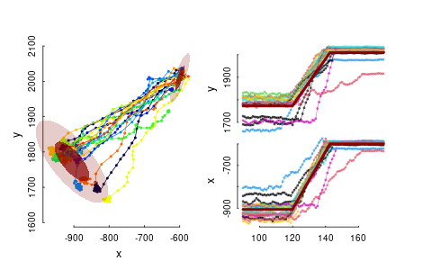

# Tuktu Migration 

An R package for estimating collective migration behavior the hierarchical migration model developed in [Gurarie et al. (2019)](https://esajournals.onlinelibrary.wiley.com/doi/full/10.1002/ecs2.2971) to estimate migration timing for barren-ground caribou across North America.  This package uses a Bayesian MCMC sampler using [RStan](https://mc-stan.org/users/interfaces/rstan).  

A resulting analysis looks something like The figure below: 



illustrating the hierarchial range ellipse and estimates (with population-level standard deviations) of migration departure and arrival times for a population of migrating caribou:

To install the package, run:

```
devtools::install_github("https://github.com/EliGurarie/TuktuMigration")
```

> **Note:** you may have to update quite a few packages to get TuktuMigration to 
> install, which (in our informal experience) involved restarting R a few times 
> along the way. On Windows machines, you will also need to install the latest version
> of [Rtools](https://cran.r-project.org/bin/windows/Rtools/). But persist! 

Running the estimation relies on several functions from [TuktuTools](https://github.com/ocouriot/TuktuTools) package as well, which can be installed via:

```
devtools::install_github("https://github.com/ocouriot/TuktuTools", build_vignettes = TRUE)
```


